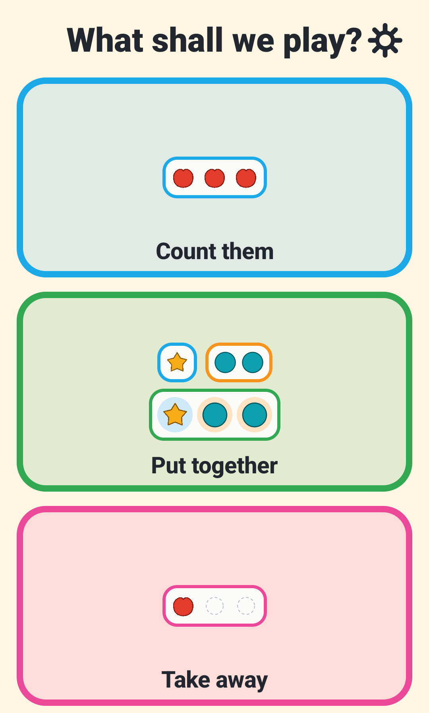
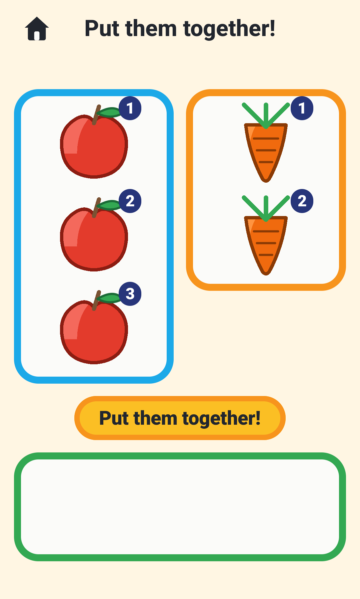
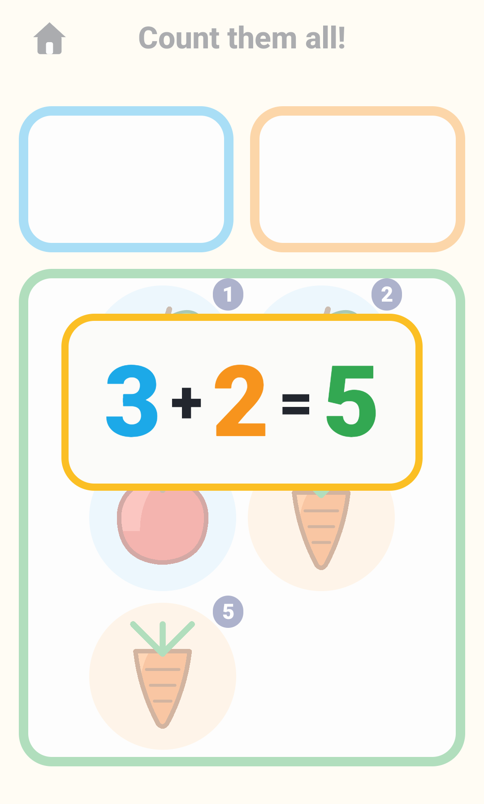
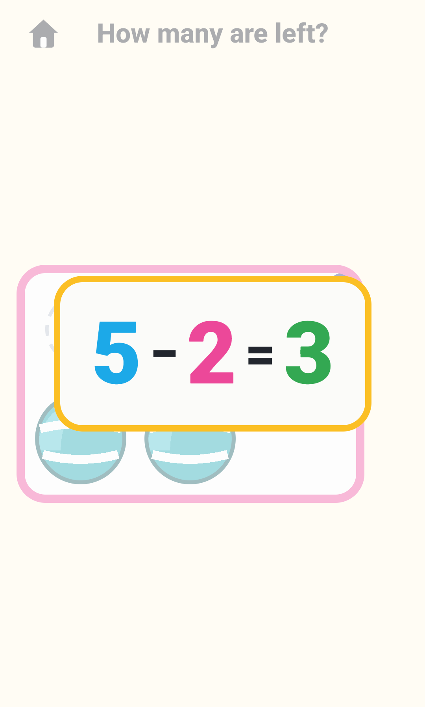
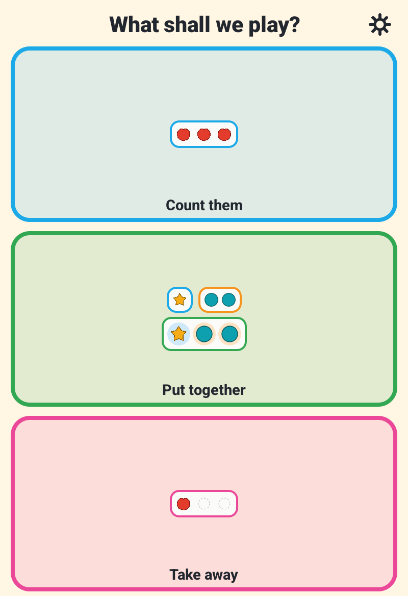
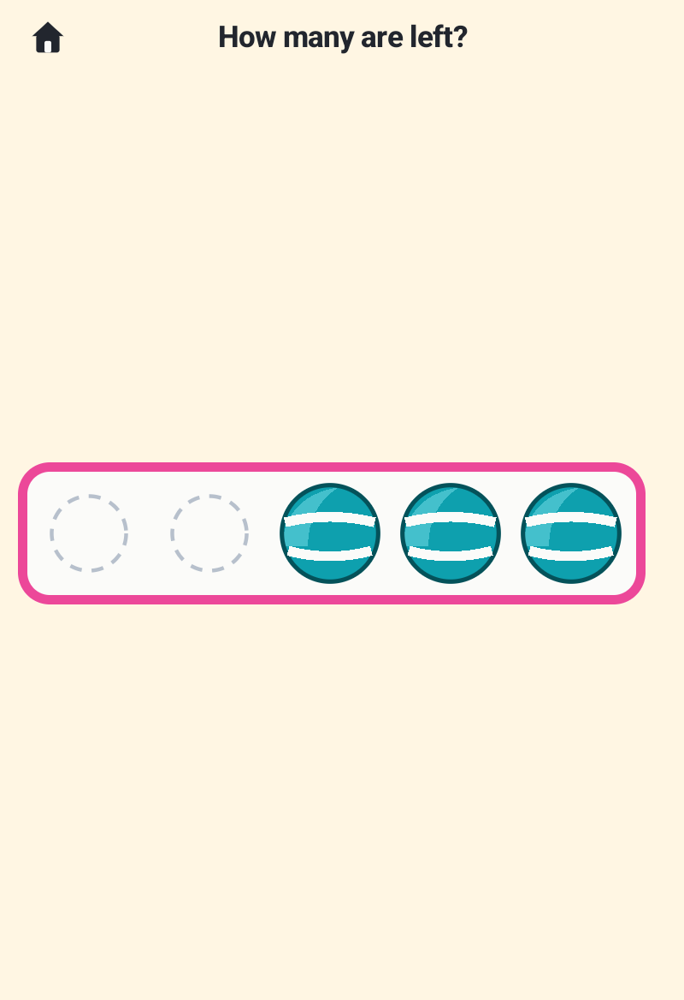
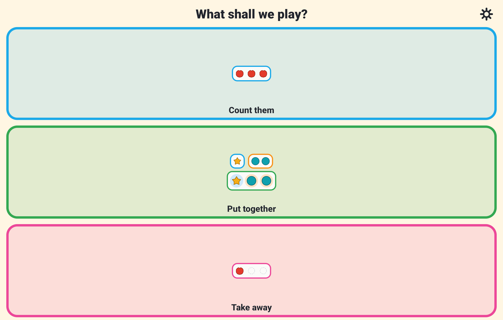
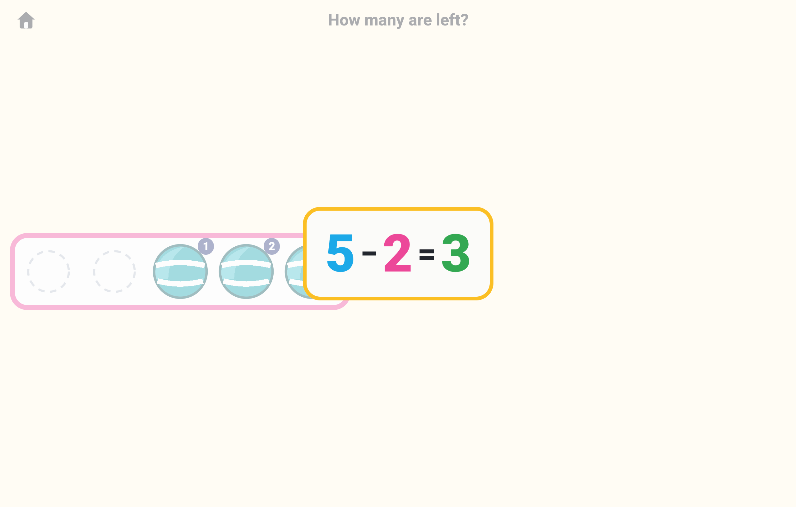

# Count & Play

A native Android app that helps a very young child *see* what numbers are, and
what adding and taking away do to them. Built by a father for his 3-year-old
son; on Google Play so other families can use it too. In English and বাংলা.

[](https://play.google.com/store/apps/details?id=app.maqsadah.count_and_play.twa)

- **Play Store package:** `app.maqsadah.count_and_play.twa`
- **License:** MIT
- **Privacy policy:** [online](https://muntasimulhaque.github.io/count-and-play/privacy.html) · [in this repo](docs/privacy.html)

<p align="center">
  
  
  
  
</p>

The same play on tablets (7" and 10"):

<p align="center">
  
  
  
  
</p>

## What it is

Three games on one screen, each a huge picture button. One tap starts, and from
there the app guides: nothing is locked, there is no menu, and a sitting ends
when the phone goes down. It runs full-screen, the system's status and
navigation buttons are hidden while playing, so nothing crowds the toys.

| | |
|---|---|
| **Count them** | Tap the objects in any order; each tap leaves a numbered chip in his order and the voice says its number. Whatever he taps first is "one". |
| **Put together** | He counts each plate on its own ("three!" … "two!"), taps the big button to pour them into one bowl, then counts the whole ("one … five!"). The parts keep their coloured seats inside the whole, so five reads as three-and-two at a glance. |
| **Take away** | A bowl; *"take away two"*; he taps two out, each wearing its number as it sinks into a ghost hole. Then he counts what is left himself, so "left" is a quantity he can see. |

Every round ends the same way: the fact arrives **huge on screen**, `3 + 2 = 5`
in coloured numerals, while the voice says it, and paper confetti falls. The
symbols land at the exact moment the child has just lived them.

Difficulty creeps up invisibly: totals of three, then five, then ten, and eases
again when he struggles. Two clean rounds in a row step up; drumming on the
wrong thing steps down. There is no score, no timer, no stars, no fail state,
and the app never says "wrong".

Numbers stay small on purpose. Arithmetic never exceeds **five** at first,
counting practice never exceeds ten. A 3-year-old can see three at a glance and
track one or two moving objects; twenty objects is not harder counting, it is a
different and much worse task.

Design constraints honoured throughout: **no music**, and **no depiction of any
animate being**, no people, animals, faces, or mascots anywhere, including the
icon. Warmth comes from material, weight, motion and voice instead. No ads, no
data collection, no network access, zero permissions.

## Tech

Kotlin + Jetpack Compose. The counting objects are ten shapes **drawn as vector
paths in code**, not emoji, so they are identical on every device and can never
drift into depicting a creature. The sound effects are synthesized by
`tools/make_sounds.py` and are deliberately inharmonic; only the success chime
has a pitch, and it can never play twice in quick succession.

```
core/     pure Kotlin, zero Android imports: the rules
copy/     what the words are, in English and বাংলা
host/     ViewModel, beat runner, TTS, sounds
ui/       Compose, candy toy-box
```

The organising principle: **the rules are pure data and functions; Android is a
player of those rules, not a participant.** The domain emits a script of beats
(say this, play that, show this, wait) and the host performs it, so `delay()`
exists in exactly one place. That is why the entire game is playable in plain
JVM tests, and why the store screenshots are rendered from state directly
rather than by driving a live emulator.

See [AGENTS.md](AGENTS.md) for the working rules and the pedagogy this rests on.

## Privacy

Count & Play collects no data: no accounts, no analytics, no ads, no network
access, and no third-party SDKs of any kind. Because the app declares zero
permissions, there is nothing for it to collect. The full policy is
[in this repo](docs/privacy.html) and
[hosted online](https://muntasimulhaque.github.io/count-and-play/privacy.html).

## Building

```
./gradlew :app:testReleaseUnitTest      # the rules
./gradlew :app:assembleRelease          # R8 release (~1 MB)
python tools/make_sounds.py             # regenerate sound assets (deterministic)
```

Every push to `main` triggers GitHub Actions, which runs the unit tests and then
builds a **signed release AAB and APK**. Signing uses four repository secrets:
`KEYSTORE_BASE64`, `KEYSTORE_PASSWORD`, `KEY_ALIAS`, `KEY_PASSWORD`. The
keystore is never committed; if it is lost, the app can never be updated again.

A second workflow renders the Play Store screenshots on phone, 7" and 10"
emulators from `ScreenshotTest`.

## Releasing an update

1. Bump `versionCode` (+1) and `versionName` (+0.1 for a small fix, +1.0 for a
   rebuild) in `app/build.gradle.kts`.
2. Commit and push to `main`.
3. Take the signed AAB from the `latest-build` release once CI is green.
4. Play Console: create a release on the alpha track (and on Production once
   the app is live there).

Only capture new store screenshots when the UI actually changed.